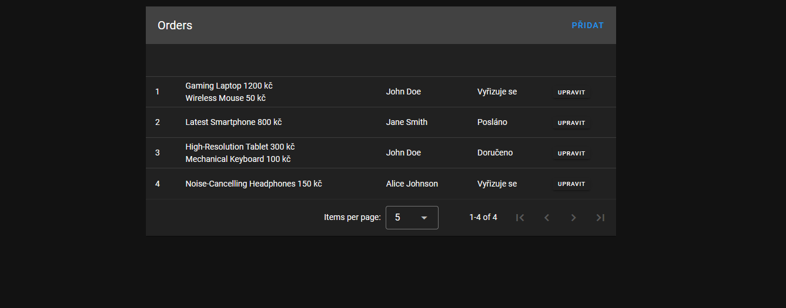

## Vaše úkoly

1. Tabulka objednávek bude podle vzhledu, který je uvedený na obrázku níže
2. U objednávek půjde upravovat jejich stav
3. Objednávky půjde vytvářet
4. Tabulka bude responzivní pro mobilní zařízení

Tyto 4 body je **nutno** vyhotovit, cokliv navíc co vytvoříte bude považáno za bonusové body.
Máte připraveno všechno co je potřeba
pro splnění úkolů, pokud se však domníváte, že něco chybí přidejte to (dependencies, komponenty ...). 
Tuto  skutečnost poté nějak zdokumentujte a odůvodněte.

Vzhled tabulky:

## Jak začít

1. Pullněte si repo k sobě
2. Nainstalujte potřebné dependencies
3. Spusťe API ve složce BE příkazem `node .` dokumentace je k dipozici na http://localhost:3001/api/
4. Spusťe frontendovou aplikaci příkazem `npm run dev` fronted http://localhost:3000
5. Můžete se pustit do práce